<h2>Tensorflow-Image-Segmentation-Augmented-Colon-Polyp (2024/05/23)</h2>

This is an experimental Image Segmentation project for Colon-Polyp based on
the <a href="https://github.com/sarah-antillia/Tensorflow-Image-Segmentation-API">Tensorflow-Image-Segmentation-API</a>, and
<a href="https://drive.google.com/file/d/17HIaIJMwUNhtJLgpqWhlMdVU9XXoFdbO/view?usp=sharing">
Colon-Polyp-ImageMask-Dataset-V1.zip</a>
, which was derived by us from the original 
 <a href="https://polyp.grand-challenge.org/CVCClinicDB/">CVC-ClinicDB</a>. 
 

 

Actual Image Segmentation Examples 
<table>
<tr>
<th width="330">Input: image</th>
<th width="330">Mask (ground_truth)</th>
<th width="330">Prediction: inferred_mask_merged</th>
</tr>
<tr>
<td>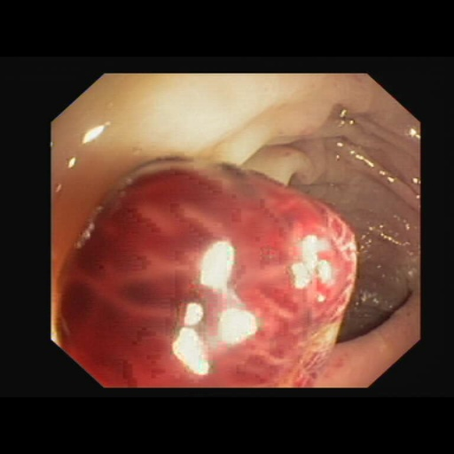</td>
<td>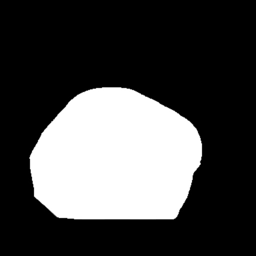</td>
<td>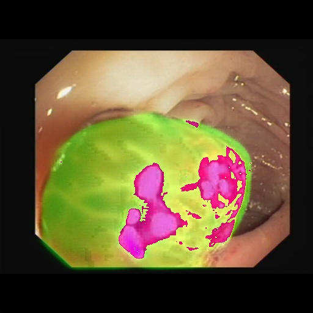</td>
</tr>
<tr>
<td>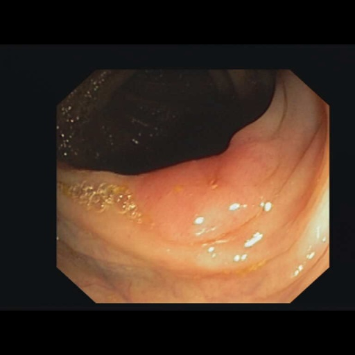</td>
<td></td>
<td>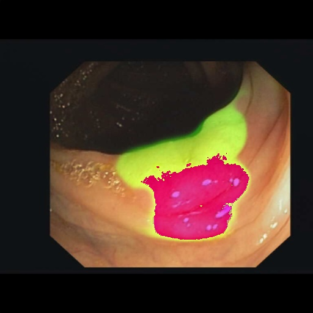</td>
</tr>

</table>

 

In order to improve segmentation accuracy, we used an online dataset augmentation strategy based on Python script <a href="./src/ImageMaskAugmentor.py">
ImageMaskAugmentor.py</a> to train a Colon-Polyp Segmentation Model. 
 
As the first trial, we used the simple UNet Model 
<a href="./src/TensorflowUNet.py">TensorflowSlightlyFlexibleUNet</a> for this Colon-Polyp Segmentation. 
As shown in <a href="https://github.com/sarah-antillia/Tensorflow-Image-Segmentation-API">Tensorflow-Image-Segmentation-API</a>.
you may try other Tensorflow UNet Models: 

<li><a href="./src/TensorflowSwinUNet.py">TensorflowSwinUNet.py</a></li>
<li><a href="./src/TensorflowMultiResUNet.py">TensorflowMultiResUNet.py</a></li>
<li><a href="./src/TensorflowAttentionUNet.py">TensorflowAttentionUNet.py</a></li>
<li><a href="./src/TensorflowEfficientUNet.py">TensorflowEfficientUNet.py</a></li>
<li><a href="./src/TensorflowUNet3Plus.py">TensorflowUNet3Plus.py</a></li>
<li><a href="./src/TensorflowDeepLabV3Plus.py">TensorflowDeepLabV3Plus.py</a></li>

 

<h3>1. Dataset Citation</h3>

The original image dataset used here has been taken from . 
<a href="https://polyp.grand-challenge.org/CVCClinicDB/">CVC-ClinicDB</a>
  
CVC-ClinicDB is the official database to be used in the training stages of MICCAI 2015 Sub-Challenge on 
Automatic Polyp Detection Challenge in Colonoscopy Videos .
  
<b>Download link</b> 
You can download CVC-ClinicDB database from the following <a href="https://www.dropbox.com/s/p5qe9eotetjnbmq/CVC-ClinicDB.rar?dl=0"> 
CVC-ClinicDB.rar</a>
 
 
<b>Copyright</b> 
Images from folder ‘Original’ are property of Hospital Clinic, Barcelona, Spain 
Images from folder ‘Ground Truth’ are propery of Computer Vision Center, Barcelona, Spain 
 
<b>Referencing</b> 
The use of this database is completely restricted for research and educational purposes.  
The use of this database is forbidden for commercial purposes. 
 
If you use this database for your experiments please include the following reference: 
Bernal, J., Sánchez, F. J., Fernández-Esparrach, G., Gil, D., Rodríguez, C., & Vilariño, F. (2015).  
WM-DOVA maps for accurate polyp highlighting in colonoscopy: Validation vs. saliency maps from physicians.  
Computerized Medical Imaging and Graphics, 43, 99-111 . 
 

<h3>
<a id="2">
2 Colon-Polyp ImageMask Dataset
</a>
</h3>
 If you would like to train this Colon-Polyp Segmentation model by yourself,
 please download the jpg 512x512 dataset from the google drive 
<a href="https://drive.google.com/file/d/17HIaIJMwUNhtJLgpqWhlMdVU9XXoFdbO/view?usp=sharing">
Colon-Polyp-ImageMask-Dataset-V1.zip</a>
, which was derived by us from the original 
 <a href="https://www.dropbox.com/s/p5qe9eotetjnbmq/CVC-ClinicDB.rar?dl=0"> 
CVC-ClinicDB.rar</a>
 
<!--
Please see also <a href="https://github.com/sarah-antillia/ImageMask-Dataset-Colon-Polyp">ImageMask-Dataset-Colon-Polyp</a>. 
-->
 

 
Please expand the downloaded ImageMaskDataset and place them under <b>./dataset</b> folder to be

<pre>
./dataset
└─Colon-Polyp
    ├─test
    │  ├─images
    │  └─masks
    ├─train
    │  ├─images
    │  └─masks
    └─valid
        ├─images
        └─masks
</pre>

Train images sample 
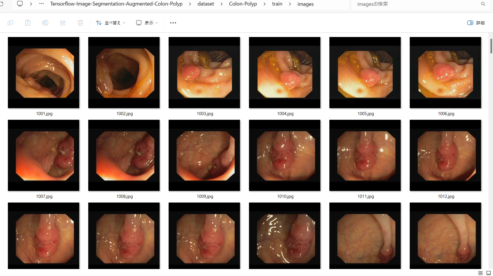.  
Train masks sample 
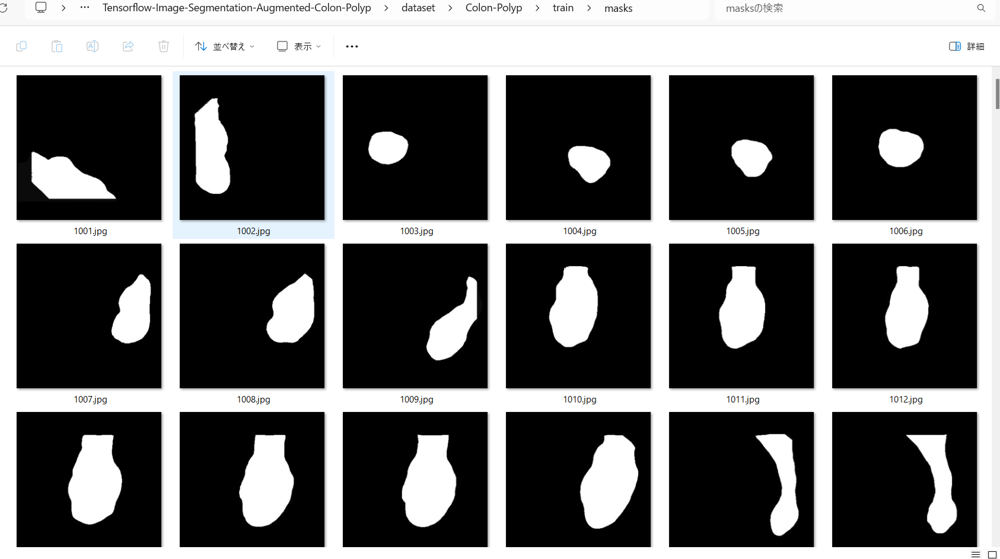.  

  
<b>Colon-Polyp Dataset Statistics</b> 
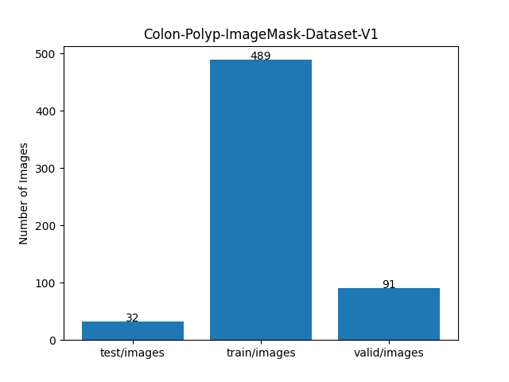 

As shown above, the number of images of train and valid dataset is not necessarily large. Therefore the online dataset augmentation strategy may 
be effective to improve segmentation accuracy.

 

<h3>
<a id="3">
3 TensorflowSlightlyFlexibleUNet
</a>
</h3>
This <a href="./src/TensorflowUNet.py">TensorflowUNet</a> model is slightly flexibly customizable by a configuration file. 
For example, <b>TensorflowSlightlyFlexibleUNet/Colon-Polyp</b> model can be customizable
by using <a href="./projects/TensorflowSlightlyFlexibleUNet/Colon-Polyp/train_eval_infer.config">train_eval_infer.config</a>
<pre>
; train_eval_infer.config
; 2024/05/23 (C) antillia.com

[model]
model          = "TensorflowUNet"
generator      = True
image_width    = 512
image_height   = 512
image_channels = 3
num_classes    = 1
base_filters   = 16
base_kernels   = (5,5)
num_layers     = 8
dropout_rate   = 0.05
learning_rate  = 0.0001
clipvalue      = 0.5
dilation       = (2,2)
loss           = "bce_dice_loss"
metrics        = ["binary_accuracy"]
show_summary   = False

[dataset]
;Please specify a claSss name of your ImageDataset.
datasetclass  = "ImageMaskDataset"
color_order   = "bgr"

[train]
epochs           = 100
batch_size       = 2
steps_per_epoch  = 200
validation_steps = 100
patience       = 10
;metrics       = ["iou_coef", "val_iou_coef"]
metrics        = ["binary_accuracy", "val_binary_accuracy"]
model_dir      = "./models"
eval_dir       = "./eval"
image_datapath = "../../../dataset/Colon-Polyp/train/images/"
mask_datapath  = "../../../dataset/Colon-Polyp/train/masks/"
create_backup  = False
learning_rate_reducer = True
reducer_patience      = 4
save_weights_only     = True

[eval]
image_datapath = "../../../dataset/Colon-Polyp/valid/images/"
mask_datapath  = "../../../dataset/Colon-Polyp/valid/masks/"

[test] 
image_datapath = "../../../dataset/Colon-Polyp/test/images/"
mask_datapath  = "../../../dataset/Colon-Polyp/test/masks/"

[infer] 
images_dir    = "./mini_test/images/"
output_dir    = "./mini_test_output"
merged_dir    = "./mini_test_output_merged"

[segmentation]
colorize      = True
black         = "black"
white         = "green"
blursize      = None

[mask]
blur      = False
blur_size = (3,3)
binarize  = False
threshold = 127

[generator]
debug        = True
augmentation = True

[augmentor]
vflip       = True
hflip       = True
rotation    = True
angles      = [90,180, 270]
shrinks     = [0.8]
shears      = [0.1]
deformation = True
distortion  = True

[deformation]
alpah    = 1300
sigmoid  = 8

[distortion]
gaussian_filter_rsigma= 40
gaussian_filter_sigma = 0.5
distortions           = [0.03,]

</pre>

Please note that the online augementor <a href="./src/ImageMaskAugmentor.py">
ImageMaskAugmentor.py</a> reads the parameters in [generator] and [augmentor] sections, 
and yields some images and mask depending on the batch_size,
 which are used for each epoch of the training and evaluation process of this UNet Model. 
<pre>
[augmentor]
vflip       = True
hflip       = True
rotation    = True
angles      = [90,180, 270]
shrinks     = [0.8]
shears      = [0.1]
deformation = True
distortion  = True

[deformation]
alpah    = 1300
sigmoid  = 8

[distortion]
gaussian_filter_rsigma= 40
gaussian_filter_sigma = 0.5
distortions           = [0.03,]

</pre>
Depending on these parameters in [augmentor], [deformation], and [distortion] sections, ImageMaskAugmentor.py generates  
vflipped, 
 hflipped,  
rotated,  
shrinked, 
sheared,  
deformed  
and distorted images and masksfrom the original images and masks in the folders specified by image_datapath and mask_datapath in 
[train] and [eval] sections. 
<pre>
[train]
image_datapath = "../../../dataset/Colon-Polyp/train/images/"
mask_datapath  = "../../../dataset/Colon-Polyp/train/masks/"
[eval]
image_datapath = "../../../dataset/Colon-Polyp/valid/images/"
mask_datapath  = "../../../dataset/Colon-Polyp/valid/masks/"
</pre>

On deformation and distortion, please see also 
<a href="https://github.com/sarah-antillia/ImageMask-Dataset-Offline-Augmentation-Tool">
ImageMask-Dataset-Offline-Augmentation-Tool.</a>.
 

<h3>
3.1 Training
</h3>
Please move to a <b>./projects/TensorflowSlightlyFlexibleUNet/Colon-Polyp</b> folder, 
and run the following bat file to train TensorflowUNet model for Colon-Polyp. 
<pre>
./1.train.bat
</pre>
, which simply runs <a href="./src/TensorflowUNetTrainer.py">TensorflowUNetTrainer.py </a>
in the following way.

<pre>
python ../../../src/TensorflowUNetTrainer.py ./train_eval_infer.config
</pre>

The following debug setting is helpful whether your parameters in [augmentor] section are good or not good.
<pre>
[generator]
debug     = True
</pre>
You can check the yielded images and mask files used in the actual train-eval process in the following folders under
<b>./projects/TensorflowSlightlyFlexibleUNet/Colon-Polyp/</b>.  
<pre>
generated_images_dir
generated_masks_dir
</pre>

Sample images in generated_images_dir 
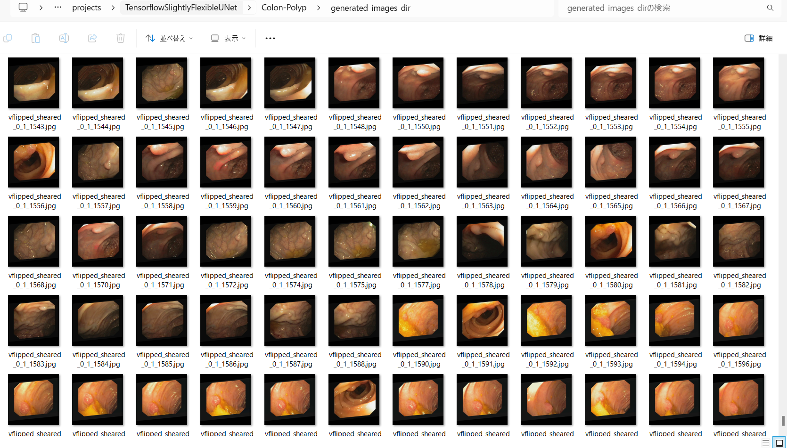 
Sample masks in generated_masks_dir 
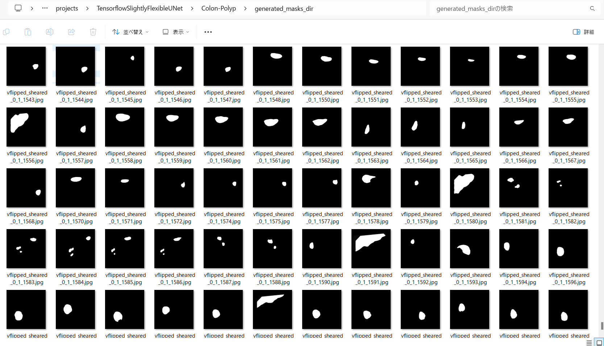 

 
Train console output: 
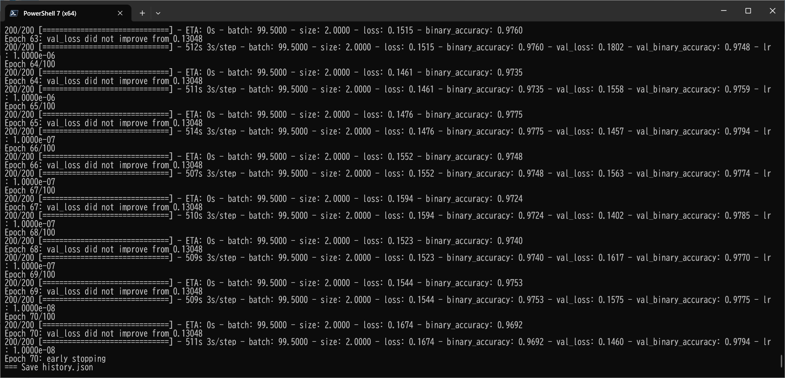 

 
<a href="./projects/TensorflowSlightlyFlexibleUNet/Colon-Polyp/eval/train_metrics.csv">train_metrics.csv</a> 
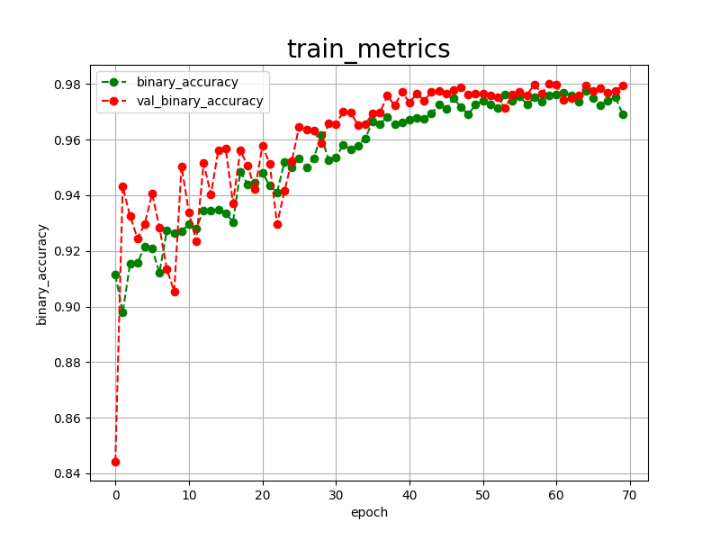 

 
<a href="./projects/TensorflowSlightlyFlexibleUNet/Colon-Polyp/eval/train_losses.csv">train_losses.csv</a> 
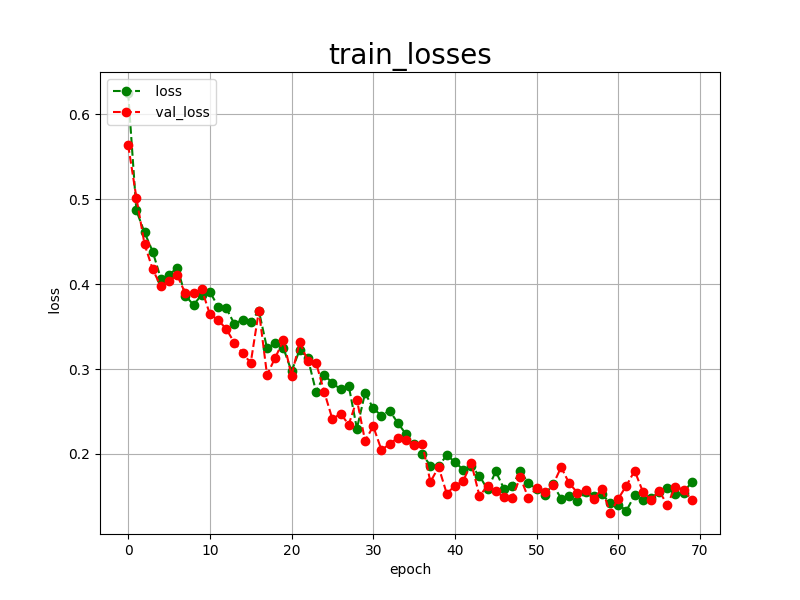 
 

<h3>
3.2 Evaluation
</h3>
Please move to a <b>./projects/TensorflowSlightlyFlexibleUNet/Colon-Polyp</b> folder, 
and run the following bat file to evaluate TensorflowUNet model for Colon-Polyp. 
<pre>
./2.evaluate.bat
</pre>
<pre>
python ../../../src/TensorflowUNetEvaluator.py ./train_eval_infer_aug.config
</pre>
Evaluation console output: 
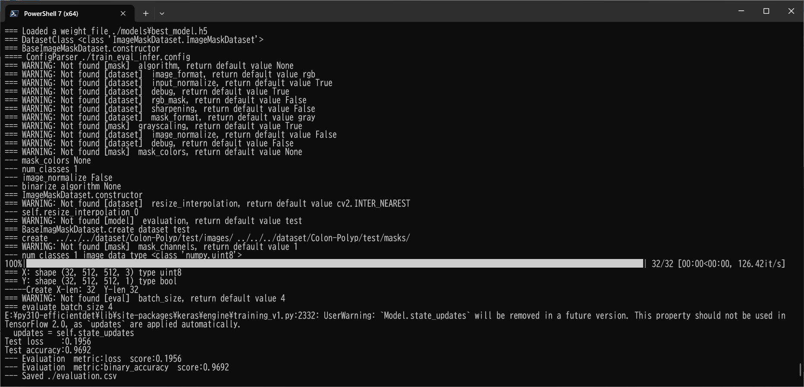
 
<a href="./projects/TensorflowSlightlyFlexibleUNet/Colon-Polyp/evaluation.csv">evaluation.csv</a> 
The loss (bce_dice_loss) score for this test dataset is very low, and accuracy very heigh as shown below. 
<pre>

loss,0.0259
binary_accuracy,0.9988
</pre>

<h2>
3.3 Inference
</h2>
Please move to a <b>./projects/TensorflowSlightlyFlexibleUNet/Colon-Polyp</b> folder 
,and run the following bat file to infer segmentation regions for images by the Trained-TensorflowUNet model for Colon-Polyp. 
<pre>
./3.infer.bat
</pre>
<pre>
python ../../../src/TensorflowUNetInferencer.py ./train_eval_infer_aug.config
</pre>

Sample test images 
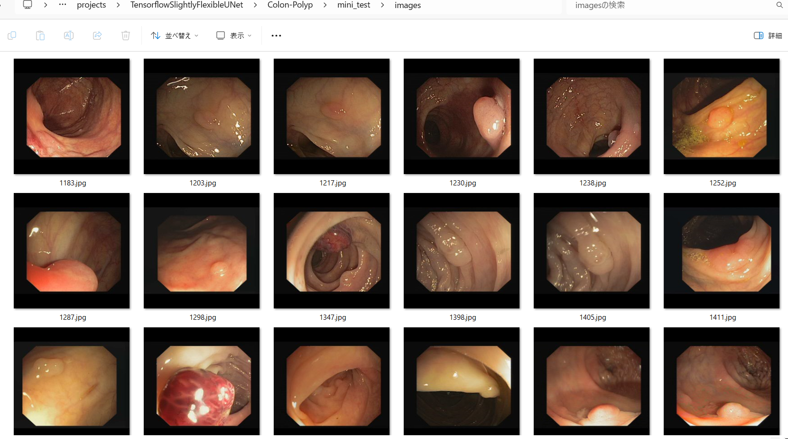 
Sample test mask (ground_truth) 
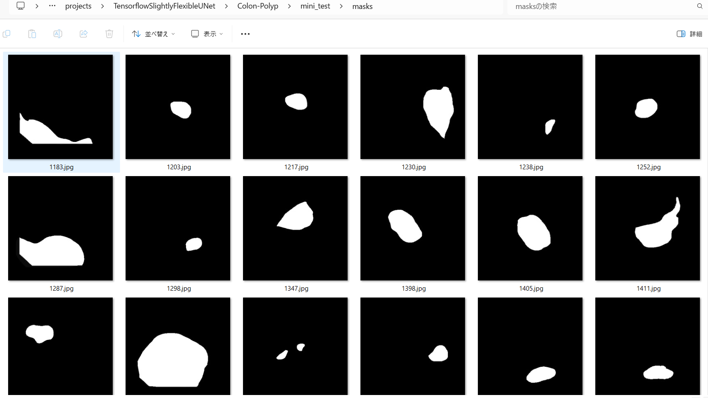 

 

Inferred test masks (colorized as green) 
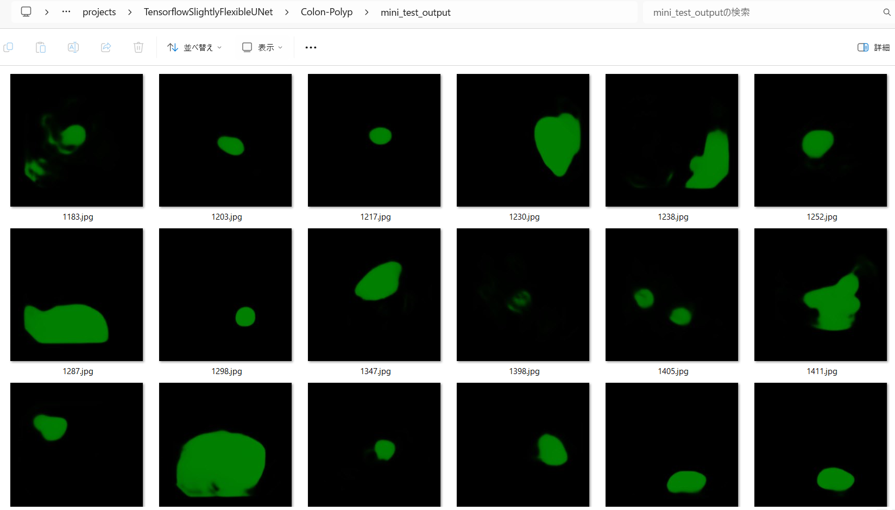 
 
Merged test images and inferred masks  
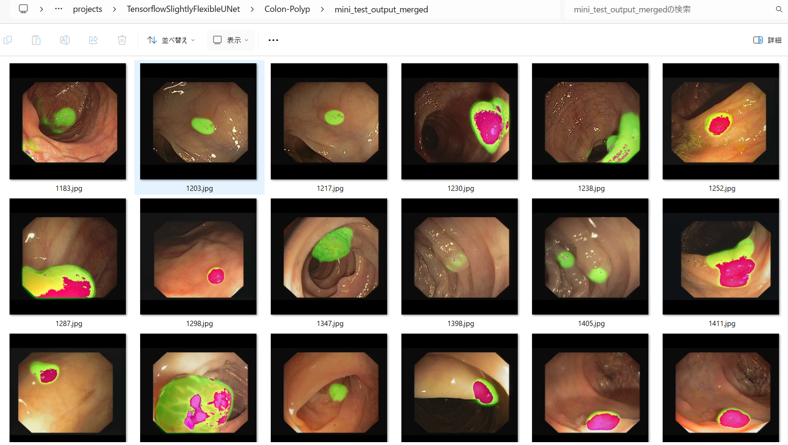  

<b>Enlarged images and masks</b> 

<table>
<tr>
<th>Image</th>
<th>GroundTruth</th>
<th>Inferred-mask-merged</th>
</tr>

<tr>
<td>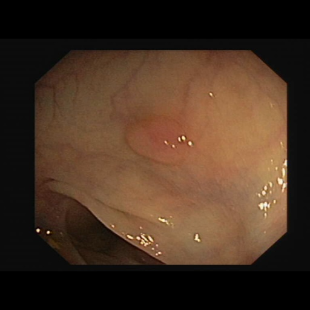</td>
<td></td>
<td>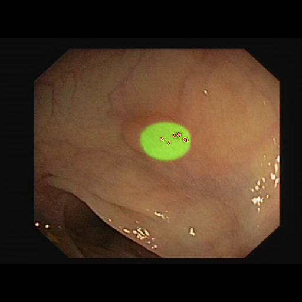</td>
</tr>

<tr>
<td>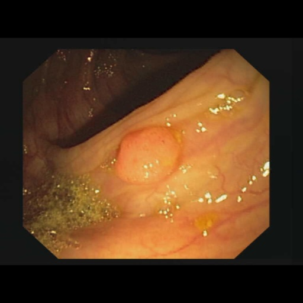</td>
<td></td>
<td>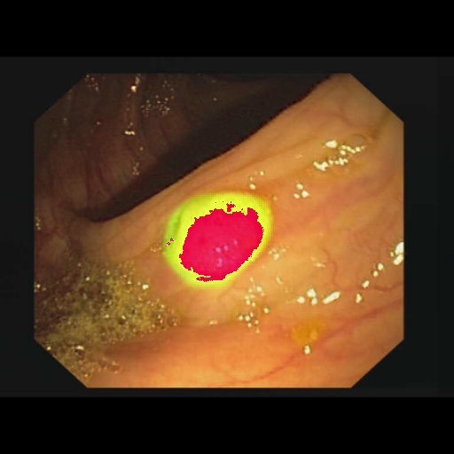</td>
</tr>

<tr>
<td>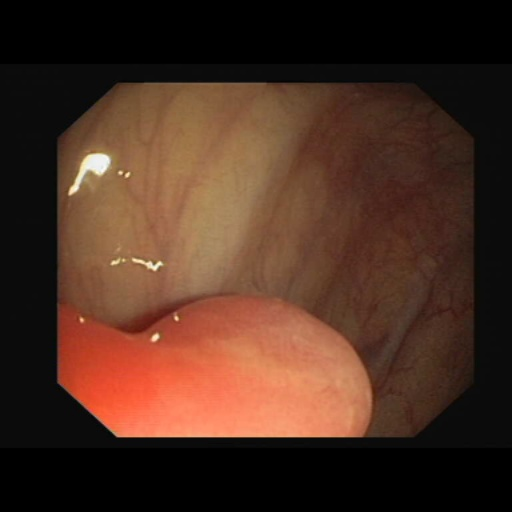</td>
<td>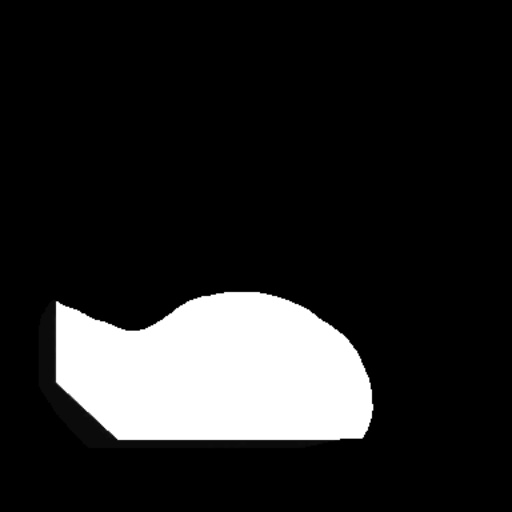</td>
<td>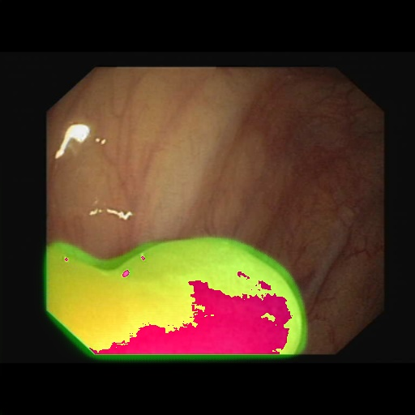</td>
</tr>

<tr>
<td></td>
<td></td>
<td></td>
</tr>
<tr>
<td></td>
<td></td>
<td></td>
</tr>

</table>
 

<h3>
References
</h3>

<b>1. Shallow and reverse attention network for colon polyp segmentation
</b> 
Scientific Reports volume 13, Article number: 15243 (2023)   
Lee, GE., Cho, J. & Choi, SI  
<pre>
https://www.nature.com/articles/s41598-023-42436-z
</pre>

